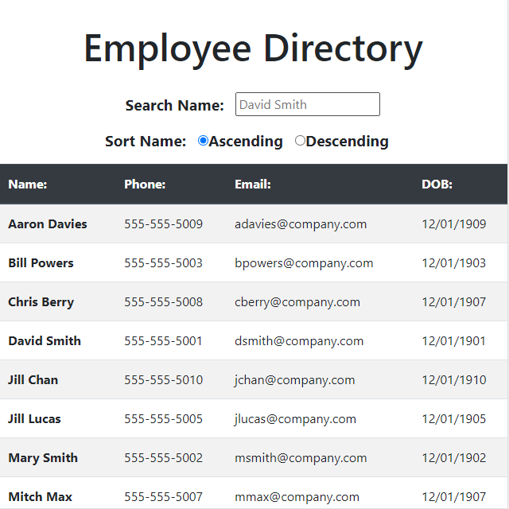

employee_directory

  ## Description:
  This is a Reactive app that allows sorting and filtering of an employee directory.

  ## Links:
  * [Repo](https://github.com/locutusOO1/employee_directory)
  * [Deployed Site](https://locutusoo1.github.io/employee_directory/)

  ## Table of Contents:
  * [Installation](#installation)
  * [Usage](#usage)
  * [Technology Used](#technology-used)
  * [Questions](#questions)
  * [Screenshots](#screenshots)

  ## Installation:
  * Install dependencies by running "npm install" from the terminal.
  
  ## Usage:
  * Run "npm start" from the terminal to start the server.

  ## Technology Used:
  * Node.js - for JS runtime environment
  * JS/ES6+ - for program logic
  * Bootstrap - for responsive style
  * React - for components and state handling

  ## Questions:
  * Feel free to checkout my [GitHub Profile](https://github.com/locutusOO1).

  ## Screenshots:
  ### Employee Directory:

  